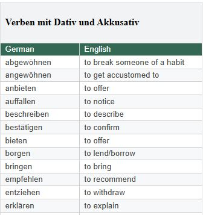

# Vocabulary Teacher

Vocabulary Teacher is a small vocabulary practice app with a FastAPI backend and a static Alpine.js frontend. The backend fetches a published Google Doc, parses the html into JSON, and exposes them through one endpoint. The frontend loads that endpoint, caches usable vocabulary in `localStorage` until midnight, and gives learners a simple German UI for category-based practice.

## Features

- Organizes words by category so users can study one topic at a time or review everything together.
- Lets users instantly filter across words, translations, examples, and categories.
- Creates random practice sets from all words or from a selected category.

## How It Works

- The backend fetches vocabulary source HTML from `DOC_URL`.
- Parsed vocabulary is served from a single `GET /vocabulary` endpoint.
- The frontend caches non-empty API responses in `localStorage` until the next midnight.
- Empty responses are not cached, so temporary source or parsing issues do not poison the browser cache.

## Project Shape

```text
server/main.py                 FastAPI app, CORS, and route lockdown
server/routes/vocabulary.py    /vocabulary route and API error mapping
server/services/vocabulary.py  HTML fetching and vocabulary parsing
server/requirements.txt        Backend dependencies
server/tests/                  Backend parser tests
index.html              Static German frontend
index.js                Frontend state, caching, filtering, and shuffle logic
```

## Expected Source HTML

The parser expects the Google Doc to have a table like this:



```html
<table>
  <thead>
    <tr>
      <td>
        <h2><span>Verben mit Dativ und Akkusativ</span></h2>
      </td>
    </tr>
  </thead>
  <tbody></tbody>
  <tbody>
    <tr>
      <td>
        <p><span>German</span></p>
      </td>
      <td>
        <p><span>English</span></p>
      </td>
    </tr>
    <tr>
      <td>
        <p><span>abgewöhnen</span></p>
      </td>
      <td>
        <p><span>to break someone of a habit</span></p>
      </td>
    </tr>
  </tbody>
</table>
```

## Configuration

Create `server/.env` from `server/.env.example`:

```text
DOC_URL=https://example.com/vocabulary.html
CORS_ALLOW_ORIGINS=http://localhost:8000,http://127.0.0.1:8000,null
```

`CORS_ALLOW_ORIGINS` is a comma-separated allowlist. The default includes `null` so the app can be opened directly from `index.html` during local development.

## Running Locally

```powershell
cd server
```

Create and activate a virtual environment:

```powershell
python -m venv venv
.\venv\Scripts\activate
```

Install dependencies:

```powershell
pip install -r requirements.txt
```

Run the API from the project root:

```powershell
uvicorn main:app --host 127.0.0.1 --port 5000 --reload
```

Open `index.html` in a browser. The frontend calls:

```text
http://localhost:5000/vocabulary
```

## Tests

Run the parser tests under `server` with:

```powershell
pytest
```
